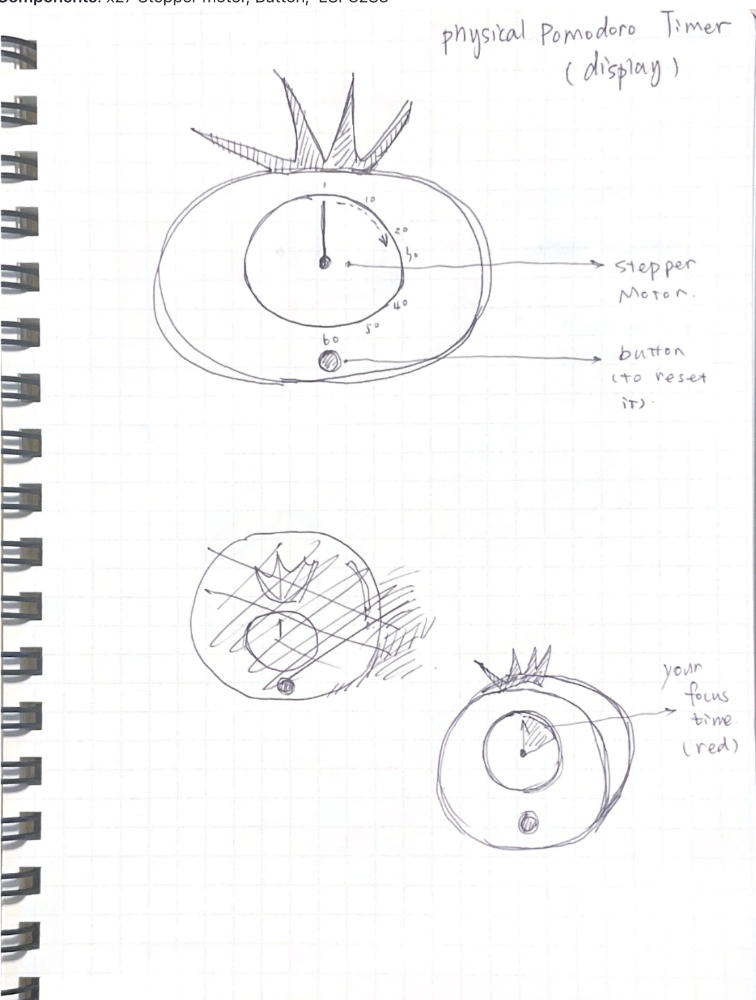

## **1\. Project**

*   **Title**: Physical Pomodoro Timer
*   **Description**: The Physical Pomodoro Timer is a device that helps you concentrate on work and study. It consists of two parts: a wearable device with a motion sensor that detects your consistent working or studying, and the Physical Pomodoro Timer itself, the stepper motor which displays how much time you are focused on, the button can reset the focus cycle.
*   **Sketch**: 

## **2.Sensor Device**

*   **Components**: Accelerometer sensor（MPU-6050）, ESP32S3, OLED Display, Battery, Buzzer

## **3.Display Device**

*   **Components**: x27 Stepper motor, Button,  ESP32S3

## **4.System Architecture**

